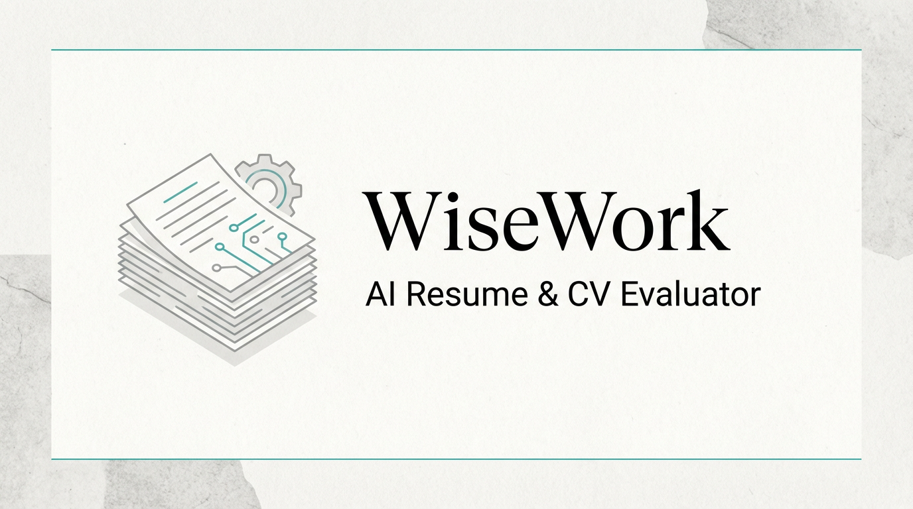
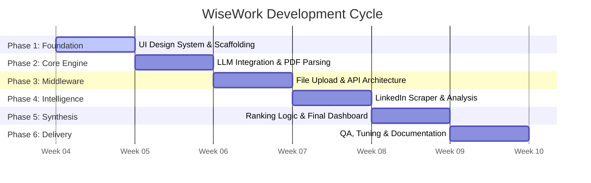

<div align="center">



# 🧠 WiseWork: AI Resume & CV Evaluator

[](https://reactjs.org/)
[](https://www.typescriptlang.org/)
[](https://nodejs.org/)
[](https://vitejs.dev/)
[](https://tailwindcss.com/)

**Empowering Recruitment with Intelligent Automation and Deep Candidate Insights.**

[Overview](#-overview) • [Key Features](#-key-features) • [Tech Stack](#-tech-stack) • [Roadmap](#-6-week-timeline) • [Setup](#-getting-started)

</div>

---

## 📖 Overview

**WiseWork** is a state-of-the-art AI-powered recruitment engine designed to eliminate the manual bottleneck of screening resumes. By leveraging advanced Large Language Models, WiseWork parses, analyzes, and ranks candidates with surgical precision, providing recruiters with actionable insights and a holistic view of every profile—including LinkedIn integration.

---

## ✨ Key Features

| Feature | Description |
| :--- | :--- |
| **🚀 Multi-CV Batch Processing** | Instantly upload and analyze dozens of resumes in parallel with high-speed parsing. |
| **🎯 Intelligent Scoring** | Proprietary AI ranking (0-100) based on custom job descriptions or project requirements. |
| **🔍 Deep Skill Extraction** | Automated identification of core competencies, gaps, and hidden potential. |
| **🔗 LinkedIn Synergy** | Summarize professional trajectories and cross-reference CV data with live LinkedIn profiles. |
| **💎 Premium UI/UX** | A sleek, dark-themed dashboard with glassmorphism components and fluid micro-animations. |

---

## 📂 Project Structure

```bash
Ai/
├── assets/             # Static assets (Banners, images)
├── client/             # Frontend Application (React + Vite)
│   ├── public/         # Public static files
│   ├── src/            # Source code
│   │   ├── components/ # Reusable UI components
│   │   ├── App.tsx     # Main application entry
│   │   └── main.tsx    # Bootstrapper
│   └── index.html      # HTML Entry point
├── server/             # Backend API (Node.js + Express)
│   └── src/            # Server source code
└── README.md           # Project Documentation
```

---

## 🛠️ Tech Stack

### Frontend
- **Framework**: `React 18` + `TypeScript`
- **Build Tool**: `Vite`
- **Styling**: `Tailwind CSS v4` (Glassmorphism Design System)
- **Animations**: `Framer Motion`

### Backend
- **Runtime**: `Node.js` + `TypeScript`
- **Server**: `Express.js`
- **AI Logic**: `OpenAI API` / `Google Gemini API`
- **File Parsing**: `pdf-parse`

---

## 📅 6-Week Implementation Roadmap

> [!NOTE]
> This roadmap outlines the strategic rollout of WiseWork's core features. Each phase is designed to build upon the previous, ensuring a stable and data-driven recruitment platform.



### 🎯 Milestone Breakdown

| Phase | Milestone | Primary Deliverables | Status |
| :--- | :--- | :--- | :--- |
| **W1** | **Foundational UI** | Atomic Design System, Layout Scaffolding, Theme Config | 🟢 Complete |
| **W2** | **AI Core** | Gemini/OpenAI Integration, Multi-format Parsers | 🟢 Complete |
| **W3** | **API Layer** | Secure File Handling, Real-time Processing Hooks | 🟢 Complete |
| **W4** | **Data Synergy** | LinkedIn Profile Summarization, Resume Contextualization | 🟢 Complete |
| **W5** | **AI Analytics** | Predictive Scoring Algorithm, Comparative Visuals | 🟢 Complete |
| **W6** | **Optimization** | Performance Audits, API Rate Limiting, User Manuals | ⚪ Planned |

---

## 🚀 Getting Started

WiseWork is now optimized for a single-command setup.

### Prerequisites
- **Node.js**: v18 or higher
- **npm**: v9 or higher

### 1. Initial Setup
Run this command from the root folder to install all dependencies for both Frontend and Backend:
```bash
npm run install:all
```

### 2. Configure Environment
A `.env` file has been created in the `server` folder. Open it and add your API keys:
```env
OPENAI_API_KEY=your_key
GEMINI_API_KEY=your_key
```

### 3. Run the Application
Start both the Frontend and Backend simultaneously with one command:
```bash
npm run dev
```
- **Frontend**: [http://localhost:5173](http://localhost:5173)
- **Backend API**: [http://localhost:5000](http://localhost:5000)

---

<div align="center">
  <sub>Built with ❤️ for Excellence in AI Recruitment.</sub>
</div>
