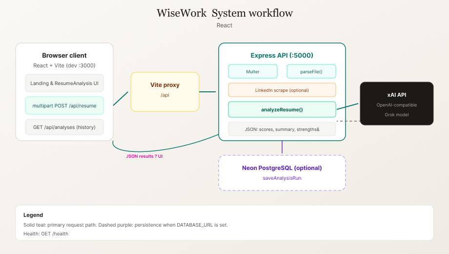

# WiseWork — Codebase Overview (Instructor Brief)

This document explains **what the project is**, **how the frontend and backend cooperate**, and **how data flows** through the system. It is written for someone evaluating or teaching the work (for example, a course instructor).

---

## Visual reference (project assets)

Static artwork lives under **`assets/`** at the repository root. These images support README and documentation; they do not ship as runtime UI unless copied into `client/public` separately.

**Product banner** — brand and positioning for WiseWork (aligned with the landing narrative):


**User workflow** — high-level steps from input to ranked, explainable output (matches the “How it works” story on the landing page):



**Alternate banners** — additional hero-style graphics for slides or reports: [`wisework_banner1.png`](./assets/wisework_banner1.png), [`wisework_banner3.png`](./assets/wisework_banner3.png).

---

## 1. What the application does

**WiseWork** is an AI-assisted **resume screening** web application. A recruiter or hiring team can:

- Upload one or more résumé files (PDF, Word, etc., depending on server parsing support),
- Optionally supply a **LinkedIn URL** so the backend can enrich context with scraped public profile data,
- Receive **structured AI analysis** for each candidate: numeric scores, dimension breakdowns (e.g. technical depth, leadership), strengths, risks, and a hiring-style recommendation.

The product is presented as a **marketing landing page** with an optional **“Open analyzer”** flow that switches to the full screening UI.

---

## 2. High-level architecture

The repository is a **small monorepo**:

| Area | Role |
|------|------|
| **`client/`** | Single-page React app (Vite, TypeScript, Tailwind). Serves the landing experience and the analyzer UI. |
| **`server/`** | Node.js **Express** API: file upload, text extraction, optional LinkedIn scraping, calls to **xAI (Grok)** via an OpenAI-compatible client, and optional persistence to **Neon PostgreSQL**. |
| **Root `package.json`** | Orchestrates installing dependencies in both packages and runs **client + server together** in development (`concurrently`). |

In development, the browser talks only to the Vite dev server; **API requests to `/api/*` are proxied** to the backend (see `client/vite.config.ts`), so the frontend can use relative URLs like `/api/resume` without CORS friction during local work.

---

## 3. Frontend: content and user flow

### Entry and navigation

- **`client/src/App.tsx`** controls two modes: the **landing page** (hero, sections, calls to action) and the **analyzer** (`ResumeAnalysis`).
- The user clicks **“Open analyzer”** to set state that renders `ResumeAnalysis`; a back action returns to the landing page.

### Analyzer UI (`ResumeAnalysis.tsx`)

- Users manage a **list of candidates** (display name, optional file, optional LinkedIn URL).
- Submitting triggers a **`POST /api/resume`** request as **`multipart/form-data`** (files + text fields).
- The UI displays returned **analysis results** (scores, summaries, strengths/weaknesses, recommendation) and can **rank** successful results.
- A **“Saved”** tab fetches **`GET /api/analyses`** to show **recent runs stored in the database** when `DATABASE_URL` is configured on the server.

### Styling and UX

- Tailwind CSS v4 with project-specific design tokens; typography and layout aim for a clear, editorial “paper” feel (`PageChrome`, landing art components).

---

## 4. Backend: how requests are handled

### Server entry (`server/src/index.ts`)

- Loads environment variables from **`server/.env`** (via `loadEnv.ts`, so the path is stable even if the process working directory changes).
- Registers JSON and CORS middleware.
- Mounts API routes under **`/api`** and exposes **`GET /health`** with a simple status and whether the database connection string is present.

### Main analysis route: `POST /api/resume` (`server/src/routes/upload.ts`)

1. **Validation:** At least one of: uploaded file(s) **or** a LinkedIn URL must be present.
2. **LinkedIn (optional):** If a URL is given, the server attempts to **scrape** public page content (`linkedinScraper` service) to supplement the résumé text.
3. **Per file:** For each uploaded file, the server **parses** it to plain text (`fileParser` — PDF/Word handling as implemented).
4. **AI analysis:** Combined text is sent to **`analyzeResume`** in `aiAnalyzer.ts`, which uses the **OpenAI SDK** pointed at **xAI’s API** (`XAI_API_KEY`, `XAI_BASE_URL`, `XAI_MODEL`). The model is instructed to return **strict JSON** with fields such as scores, `cv_candidate_name`, executive summary, and recommendation.
5. **Persistence:** Each outcome (success or recorded failure) is passed to **`saveAnalysisRun`** (`analysisStore.ts`). If **`DATABASE_URL`** is not set, saves are skipped silently; the API still returns JSON results to the client.

### Saved analyses: `GET /api/analyses` (`server/src/routes/analyses.ts`)

- If the database is configured, returns a **list of recent rows** from the `analysis_runs` table (limit query parameter supported).
- If not configured, returns an empty list and `databaseConfigured: false` so the UI can explain that history is unavailable.

### Database layer (`server/src/db/client.ts`, `analysisStore.ts`)

- Uses **Neon’s serverless driver** (`@neondatabase/serverless`) with **`DATABASE_URL`**.
- **`analysis_runs`** stores metadata (candidate name, LinkedIn URL, file name), JSON **`result`**, and optional **`error`** text. Schema is applied via `server/db/schema.sql` or `npm run db:push` from the server package.

---

## 5. End-to-end data flow (summary)

```
User (browser)
    → Landing or Analyzer UI (React)
    → POST /api/resume (multipart: files, linkedinUrl, candidateName)
        → Parse files → optional LinkedIn scrape → build text
        → xAI (Grok) via OpenAI-compatible API → structured JSON per candidate
        → Optional INSERT into Neon (analysis_runs)
    ← JSON { results: [...] }

Saved tab:
    → GET /api/analyses
        → SELECT from analysis_runs (if DATABASE_URL set)
    ← JSON { runs, databaseConfigured }
```

---

## 6. Configuration (conceptual)

| Variable | Purpose |
|----------|---------|
| **`XAI_API_KEY`** | Required for AI analysis (xAI). |
| **`XAI_BASE_URL`**, **`XAI_MODEL`** | Optional overrides for the AI endpoint and model name. |
| **`DATABASE_URL`** | Optional Neon PostgreSQL connection string; enables saving and listing past runs. |
| **`PORT`** | Backend listen port (default commonly 5000; must align with Vite proxy in dev). |

Secrets belong in **`server/.env`** (or the host environment in production) and should **not** be committed.

---

## 7. How to run the project (for demonstration)

From the repository root (after installing dependencies):

- **Full stack (typical dev):** `npm run dev` — starts the Vite client and the Express server together.
- **Client only:** `npm run client`
- **Server only:** `npm run server`

Production deployment usually builds the **static client** (`client/dist`) and serves it behind a reverse proxy or CDN, while the **Node server** runs separately with the same API routes and environment variables.

---

## 8. What this demonstrates (pedagogical angle)

- **Separation of concerns:** UI vs API vs optional database.
- **Realistic integration:** file uploads, third-party AI API, optional cloud Postgres.
- **Graceful degradation:** core analysis works without a database; persistence is additive.
- **Structured LLM output:** prompting for JSON-shaped responses consumed by the UI.

---

*This file describes the architecture as implemented in this repository; feature completeness and deployment details may evolve with commits.*
